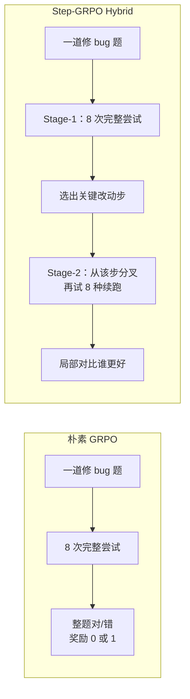
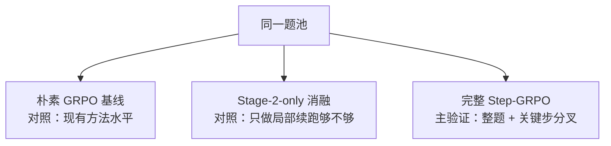
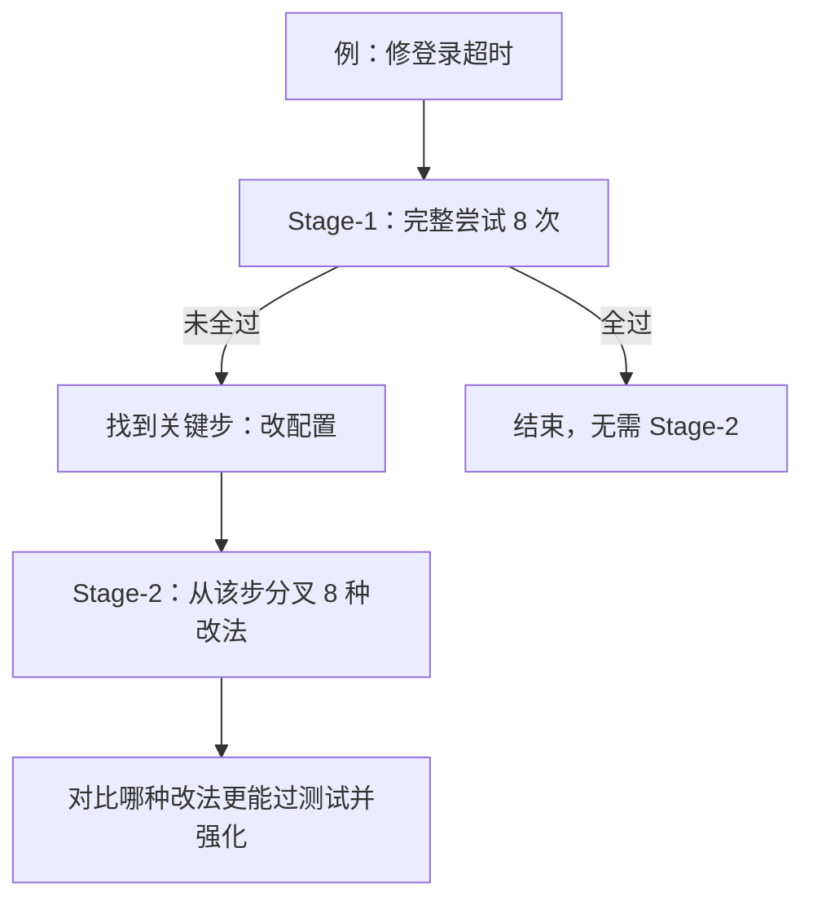

# Step-GRPO 进展汇报（项目负责人版）

日期：2026-07-14  
对象：项目负责人 / 非一线实现角色  
详细技术笔记：`2026-07-14-step-grpo-experiment-handbook.md`

> 看图：请用 Markdown 预览打开本文件（Cursor：`Cmd/Ctrl + Shift + V`）。下方为内嵌流程图；高清 PNG 在文末。

---

## 1. 一句话结论

我们正在验证：**在写代码修 bug 的场景里，给模型「先整题试错、再在关键步骤局部重试」的训练方式（Step-GRPO），能否比「整题重跑对比」的朴素 GRPO 更有效、且成本可接受。**

当前三条对照实验均已并行启动；完整版 Step-GRPO 已完成第 0 步训练，并进入第 1 步采样。**最终是否值得扩大规模，等完整版跑出 5–10 步对比曲线后再拍板。**

---

## 2. 为什么做这件事

### 朴素做法的痛点

想象一道「登录超时」修 bug 题：模型要写很长一串操作（读代码、改文件、跑测试）。  
朴素 GRPO 的做法是：**整题重跑 8 次，谁最终过测试就奖励谁**。

问题是：

- 失败轨迹往往整条都是 0 分，**中间哪一步改错了，学不到**
- 奖励只能摊到整条轨迹，**信用分配很粗**
- 长任务里容易「全对或全错」，组内没有有效对比

### 我们在验证的改进

Step-GRPO（Hybrid）分两段：

1. **先整题探索**（和朴素类似）  
2. **再挑出最值得重试的关键改动步骤，从那里分叉再试 8 次**，对比「同一步的不同改法谁更好」

**期望价值：** 同样的算力预算下，解题率更高或爬升更快；失败样本里也能挖出可学习信号。

**需要证明，而非默认成立：** 分叉会更贵；若局部对比噪声大，也可能不涨分。

---

## 3. 我们怎么比（实验设计）

同一题池、三条并行实验：

| 线 | 角色 | 回答什么问题 |
|----|------|--------------|
| 朴素 GRPO | 基线 | 现有方法能到什么水平 |
| Stage-2-only 消融 | 机制对照 | 「只做局部续跑」够不够；完整版里的整题阶段是否必要 |
| 完整 Step-GRPO | 主验证 | 整题 + 关键步分叉，是否优于基线 |

**对比口径提醒：** Hybrid 单步墙钟更长（约 2–3 小时量级 vs 基线约 1 小时量级），汇报曲线应对齐 **同等墙钟** 或 **同等训练步数**，避免只看 step 编号造成误判。

**主看指标：** 解题率（`resolved_rate`）。  
**辅助指标：** F2P 用例通过比例（反映「修对了多少失败测试」，但不等于整题已解出）。

---

## 4. 当前进展（截至 2026-07-14）

| 实验 | 状态 | 进展摘要 |
|------|------|----------|
| 朴素 GRPO | Running（~19h） | 已多步训练，作基线对照 |
| Stage-2-only 消融 | Running（~14h） | 持续跑，用于拆解机制贡献 |
| **完整 Step-GRPO** | **Running（~3h）** | **step 0 训练已完成，已进入 step 1 采样** |

完整版 step 0 的机制验收（重要）：

- 整题对比组 **有有效信号**（不再是「8 组全无对比」的异常态）
- 局部续跑组也在产出对比样本
- 说明完整版管线已按设计在工作，可继续攒对比数据

> 注意：单步结果波动大，**不据此下最终结论**；需等 5–10 步后再做方法对比。

---

## 5. 风险与资源判断

| 风险 | 说明 | 应对 |
|------|------|------|
| Hybrid 更贵 | 单步墙钟约为基线的 2×+ | 用等墙钟对比性价比；有效再 scale |
| 消融线曾踩坑 | 早期完整训练信号异常，已定位并在完整版验证修复 | 完整版与消融继续对照 |
| 显存 | 当前跑在 H200（140GB）。按现配置：朴素 GRPO 峰值贴近 96GB，换 H20 偏紧；Hybrid 峰值更低，H20 更有希望 | 若上 H20：优先优化器 CPU offload、降低推理显存占比 |
| 过早扩大 | 方法有效性尚未被曲线证明 | **先读满完整版 5–10 步，再决定是否加卡 / 加数据** |

---

## 6. 建议决策 / 下一步

1. **本周（P0）：** 保持三条实验不中断，优先等完整版跑满 **5–10 个训练步**  
2. **届时决策点：**  
   - 完整版解题率 ≥ 基线，且成本可接受 → 讨论 scale  
   - 完整版 ≈ 消融 → 复盘整题阶段是否真贡献  
   - 完整版 < 基线 → 先查采样质量 / 过滤过严，再谈扩大  
3. **暂缓：** 更复杂的蒸馏增强（OPSD）——等主方法验证过关再加

---

## 附录：举例（非技术）

**题：** 修「登录超时」。  

- 朴素做法：把整题重做 8 遍，看谁最终过测试。  
- Step-GRPO：先做 8 遍；若多数失败，找到「改配置」这一关键步，从这里再分叉试 8 种改法，专门比较哪一种配置改法更能过测试。  

目的不是「多跑一点」，而是 **把学习信号打到真正决定成败的步骤上**。

---

## 高清配图（PNG）

若预览里流程图不够清晰，可直接打开：

- [方法对比](./assets/step-grpo-report/01-method-compare.png)
- [实验三角](./assets/step-grpo-report/02-experiment-triangle.png)
- [一道题例子](./assets/step-grpo-report/03-one-problem-example.png)

