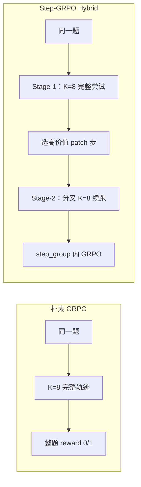
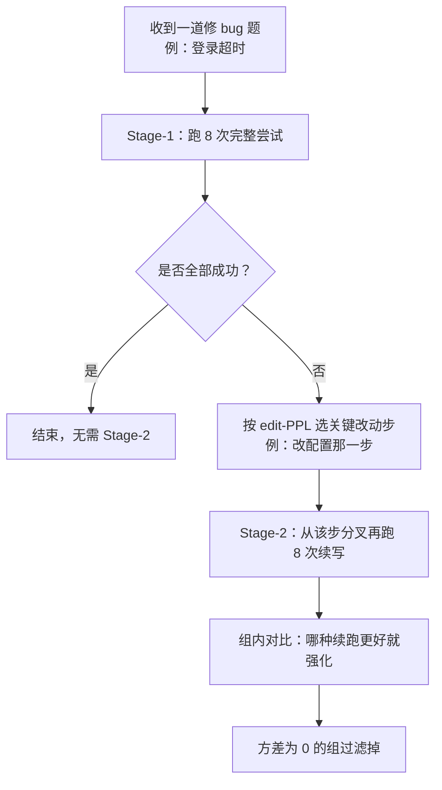
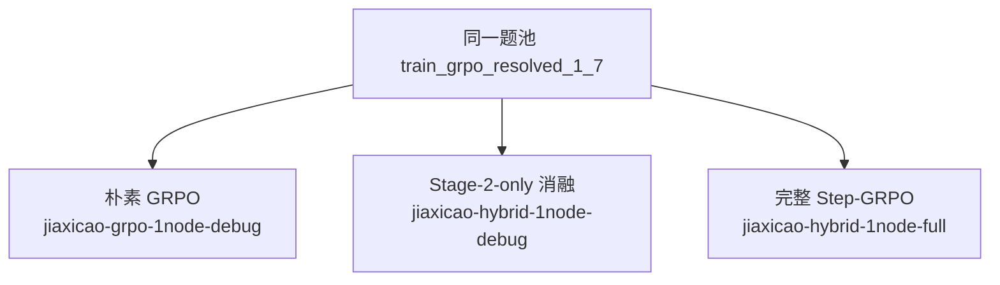
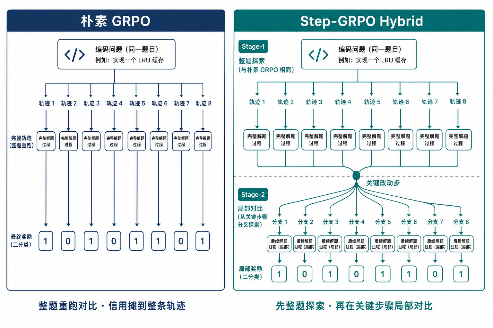
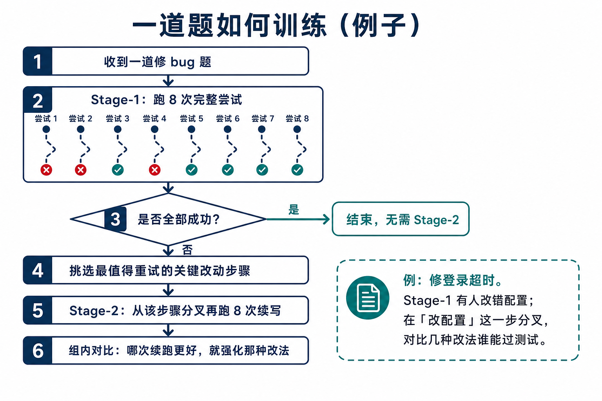
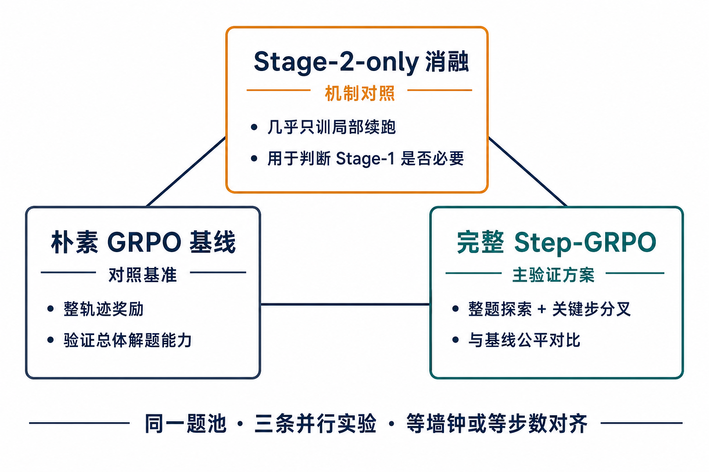

# Step-GRPO 进展汇报（Tech Lead / 组内版）

日期：2026-07-14  
对象：Tech Lead / 组内评审  
实现细节与踩坑清单：`2026-07-14-step-grpo-experiment-handbook.md`  
算法详设：`specs/2026-07-12-path-a-hybrid-step-grpo-design.md`

> 看图：请用 Markdown 预览打开本文件（Cursor：`Cmd/Ctrl + Shift + V`）。下方为内嵌流程图；高清 PNG 在文末。

---

## 1. 背景与目标

Path A（`claudecode_ags`）上对比：

- **朴素 GRPO**：整轨迹 outcome reward，prompt 级 K 样本对比  
- **Hybrid Step-GRPO**：Stage-1 整题探索 + Stage-2 在高价值 patch 步分叉续跑，再做组内 GRPO  

**要回答的问题**

1. 同等数据与相近算力下，Step-GRPO 是否带来更高 / 更快的解题率？  
2. Stage-1 是否必要？（完整版 vs Stage-2-only 消融）  
3. 额外墙钟与显存成本是否值得？  

**本轮不做：** 全量逐步分叉、OPSD / hindsight 自蒸馏。

---

## 2. 方法直觉（少实现、重语义）



| | 朴素 GRPO | Hybrid Step-GRPO |
|--|-----------|------------------|
| 对比粒度 | 整题 episode | 整题 + **同一关键步的续跑** |
| 失败样本 | 多为 reward=0，信号弱 | 失败轨迹的关键步可进入 Stage-2 挖局部对比 |
| 信用分配 | 一个 R 广播到整条轨迹 | Stage-2 更贴近「这一步改法谁更好」 |

### 例子：一道题怎么训



**例：修登录超时**

1. Stage-1：同一题跑 K=8 次完整尝试 → 做整题级 GRPO  
2. 若未全过：在失败 trial 里按 edit-PPL 选出最值得重试的 patch 步  
3. Stage-2：从该步 rebuild / 续跑 K=8 条 branch → 在 `step_group` 内做 GRPO  
4. 组内 reward 方差为 0 的组过滤掉（无对比不学）

Reward 仍是 Path A 的 binary resolved（F2P 为主，P2P 辅助），不是 soft F2P 回归。

---

## 3. 三线对照与对比口径



| 线 | Job / wandb | 含义 |
|----|-------------|------|
| 朴素 GRPO | `jiaxicao-grpo-1node-debug` / `…_grpo_debug` | 基线 |
| Stage-2-only 消融 | `jiaxicao-hybrid-1node-debug` / `…_hybrid_ltpa_v2` | 早期 vanilla episode key 问题导致 Stage-1 几乎不提供训练信号 → 意外变成「几乎只训 branch」 |
| 完整 Step-GRPO | `jiaxicao-hybrid-1node-full` / `…_hybrid_full` | 修复后的正牌 hybrid（Stage-1 + Stage-2） |

共性：同一题池 `train_grpo_resolved_1_7`；hybrid 侧 `RBS=8, K=8`。

**对比注意**

- Hybrid 单步墙钟 ≈ 2.7h，GRPO ≈ 1.1h → 用 **等 wall-clock** 或 **等 train step**，不要只看 step id  
- 顶层 `outcome/*` = Stage-1 口径；Stage-2 看 `outcome/stage-2/*`  
- 消融线上的 `outcome/resolved_rate` **不能**直接当「训练效果」（Stage-1 采样仍在，但不驱动更新）

---

## 4. 汇报时看哪些指标

### 主结论（与 GRPO 直接比）

| 指标 | 作用 |
|------|------|
| **`outcome/resolved_rate`** | 主指标：整题是否解出（与 reward 同口径） |
| `outcome/test_f2p_macro_pass_rate` | 用例级加权 F2P，辅助看修测进度 |
| `outcome/test_f2p_ratio/mean` | 每题 F2P 比例等权平均；可反映**部分进步**，但 **≠** 解题率，也不是训练目标 |

### 机制是否在工作

| 信号 | 期望（完整版） |
|------|----------------|
| log `vanilla_groups=8 (std0=?)` | `std0 < 8`（消融曾恒为 8/8） |
| log `branch_groups - std0` | 有非零，说明 Stage-2 有可学对比 |
| `train/grad_norm` | 明显高于消融的 ~0.04；与 GRPO 同量级更理想 |
| `perf/step_grpo/n_stage2_*` | Stage-2 有产出（注意 samples ≠ 有效训练量） |

### 成本

关注 `perf/rollout_time`、`perf/step_grpo/stage1_wall/*`、`stage2_wall/*`，最终用 **同等墙钟下的 resolved 曲线** 谈性价比。

---

## 5. 已知问题（汇报口径，不展开排障）

已处理、影响解读的关键点：

1. **评测 metadata 缺失** → reward 全 0（已修）  
2. **Vanilla episode key 塌缩** → Stage-1 无对比、表现为 Stage-2-only 消融（已在完整版验证：`std0=3`）  
3. **题池不一致** 会导致曲线不可比（已统一）  
4. **指标口径混用**（Stage-2 混进顶层 outcome）已隔离命名  

细节与文件索引见 handbook / `2026-07-14-hybrid-vanilla-episode-key-bug.md`。

---

## 6. 资源与显存（摘要）

当前跑在 **8×H200（约 140GB）** colocate。

| | 朴素 GRPO | Hybrid |
|--|-----------|--------|
| 训练峰值 `used_GB` | ~96 | ~80 |
| 稳态 `allocated_GB` | ~63 | ~63（同模型底座） |

峰值差主要来自 **rollout→train 交接时 SGLang 残留**（GRPO 并发轨迹更多），不是「hybrid 模型更小」。  

换 **8×H20（96GB）**：朴素 GRPO 现配置偏危险；Hybrid 更有希望，但仍建议开 optimizer CPU offload、降低 rollout mem fraction。

---

## 7. 当前状态与验收 Gate（2026-07-14）

| 实验 | 状态 | 进展 |
|------|------|------|
| GRPO | Running ~19h | 多步基线中 |
| 消融 | Running ~14h | 继续作机制对照 |
| **Full hybrid** | **Running ~3h** | **step 0 train 已完成，已进入 step 1 rollout** |

**Full step 0 机制验收（已通过设计 gate）：**

```text
vanilla_groups=8 (std0=3)     ← 非消融的 std0=8
branch_groups=40 (std0=20)
outcome/resolved_rate ≈ 0.61（Stage-1，单步参考）
train/grad_norm ≈ 0.064       ← 高于消融 ~0.04，仍偏低，需后续步观察
```

**P0 Gate（再等 5–10 step）：**

- vanilla `std0` 持续 < 8  
- `grad_norm` 稳定高于消融，并尽量靠近 GRPO 量级  
- 再填 handbook §7 结论表，决定是否 scale / 是否需要加强 Stage-1  

**暂缓：** OPSD、改 filter/GBS（等主对比结论）。

---

## 8. 对外可复述的三句话

1. 我们在验证：关键步骤局部对比，能否改善长程 coding agent 的信用分配与样本效率。  
2. 三条并行实验已齐；完整版管线机制验收通过，正在攒 5–10 步可比曲线。  
3. 最终是否扩大，看 **等墙钟解题率** 与成本，而不是单步波动或辅助 F2P mean。

---

## 高清配图（PNG）

- [方法对比](./assets/step-grpo-report/01-method-compare.png)
- [实验三角](./assets/step-grpo-report/02-experiment-triangle.png)
- [一道题例子](./assets/step-grpo-report/03-one-problem-example.png)






