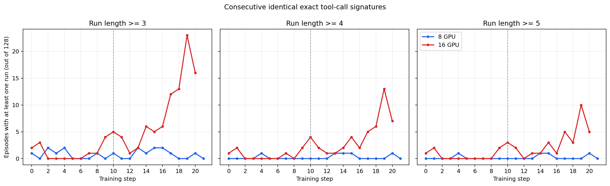
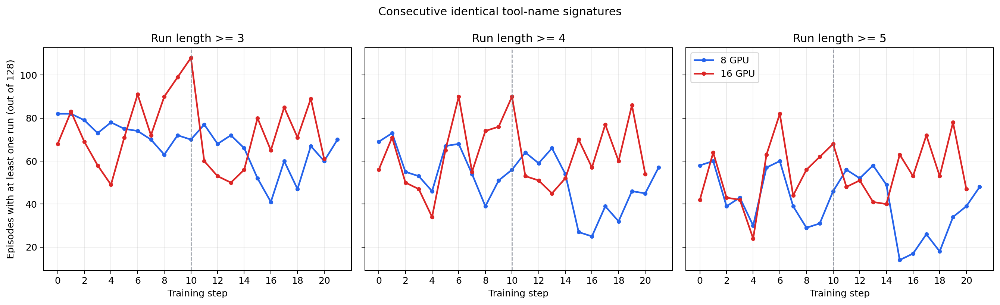

# 朴素 GRPO：连续相同工具签名随训练 step 的变化

日期：2026-07-16

## 1. 统计口径

- 每个 step 按 `session_id` 合并 compact segments，恢复为 128 条独立 episode。
- 每个 assistant turn 内的全部工具调用组成一个签名。
- 严格签名包含工具名和规范化后的完整参数；同一 turn 内的调用顺序不影响签名，重复调用次数保留。
- 没有工具调用的 assistant turn 会打断连续序列。
- `>=3`、`>=4`、`>=5` 分别表示：一条 episode 中至少出现过一次连续 3、4、5 轮相同签名。
- 每条 episode 在每个阈值下最多计数一次，因此纵轴范围是 0–128。
- 16 卡 step 0–9 来自原任务，step 10–20 来自续训任务；图中虚线标出 step 10。

## 2. 严格签名结果

| 区间 | 配置 | 连续 >=3 平均条数 | 连续 >=4 平均条数 | 连续 >=5 平均条数 |
|---|---|---:|---:|---:|
| step 0–9 | 8 卡 | 0.70 | 0.10 | 0.10 |
| step 0–9 | 16 卡 | 1.10 | 0.60 | 0.50 |
| step 10–16 | 8 卡 | 1.14 | 0.43 | 0.29 |
| step 10–16 | 16 卡 | 4.14 | 2.29 | 1.57 |
| step 17–20 | 8 卡 | 0.50 | 0.25 | 0.25 |
| step 17–20 | 16 卡 | 16.00 | 7.75 | 5.75 |

step 17–20 的逐步数据：

| Step | 8 卡 >=3 / >=4 / >=5 | 16 卡 >=3 / >=4 / >=5 |
|---:|---:|---:|
| 17 | 1 / 0 / 0 | 12 / 5 / 5 |
| 18 | 0 / 0 / 0 | 13 / 6 / 3 |
| 19 | 0 / 0 / 0 | 23 / 13 / 10 |
| 20 | 1 / 1 / 1 | 16 / 7 / 5 |

严格口径下，8 卡全程接近零；16 卡从 step 9–10 开始抬升，在 step 17–20 明显增加。
step 19 最突出：23 条 episode 连续至少 3 轮执行完全相同的工具调用，其中 10 条连续至少
5 轮。该趋势与 step 17–20 中观察到的同一 `TaskOutput(task_id=...)` 连续轮询一致。

## 3. 只看工具名的敏感性结果

下面的补充口径忽略所有参数，只将同一 turn 内的工具名多重集作为签名。例如不同命令的
单个 `Bash` turn 都会被视为相同签名。因此它能捕获“连续使用同类工具”，但基线明显更高，
不能等同于完全重复同一个命令。

| 区间 | 配置 | 连续 >=3 平均条数 | 连续 >=4 平均条数 | 连续 >=5 平均条数 |
|---|---|---:|---:|---:|
| step 0–9 | 8 卡 | 74.80 | 57.50 | 44.60 |
| step 0–9 | 16 卡 | 75.00 | 61.80 | 52.20 |
| step 10–16 | 8 卡 | 63.71 | 50.14 | 41.71 |
| step 10–16 | 16 卡 | 67.43 | 59.71 | 52.00 |
| step 17–20 | 8 卡 | 58.50 | 40.50 | 29.25 |
| step 17–20 | 16 卡 | 76.50 | 69.25 | 62.50 |

只看工具名时，两边从早期就有较高基线，主要因为连续多个 turn 都只调用一次 `Bash`、`Read`
或 `TaskOutput` 很常见。即便如此，step 17–20 的 16 卡仍明显高于 8 卡，尤其是连续 4、5 轮
的长序列。

## 4. 结论边界

这项统计能直接回答“模型是否连续重复相同工具动作”，不能单独判断每次调用是否合理。
严格签名的后期抬升说明16卡确实出现越来越多的完全重复调用；结合真实轨迹，主要表现为
后台安装任务的 `TaskOutput` 轮询。工具名签名还会把参数不同的正常连续调试计入，因此只作为
敏感性参考。

原始逐 step 数据见
[`tool_signature_runs.csv`](assets/2026-07-16-tool-signature-runs/tool_signature_runs.csv)，复现脚本见
[`tool_signature_runs.py`](../../../examples/claudecode_ags/analysis/tool_signature_runs.py)。
