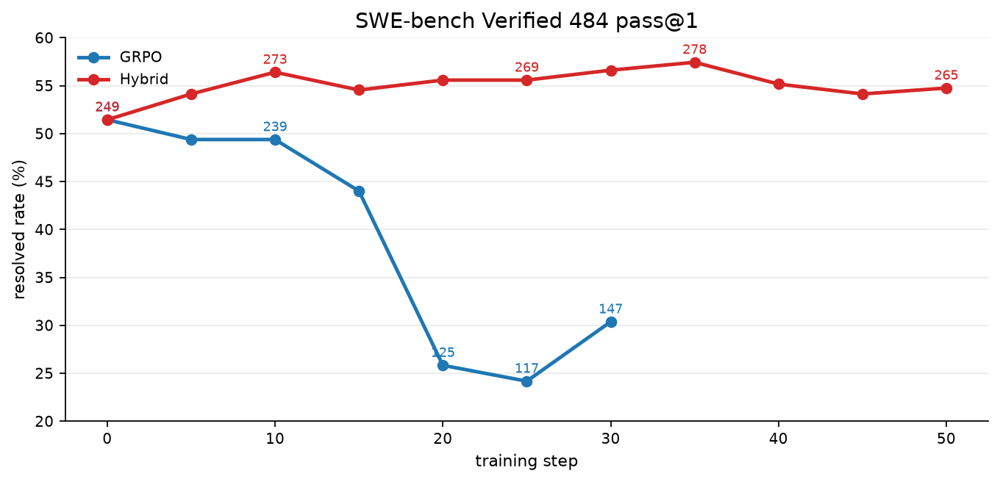
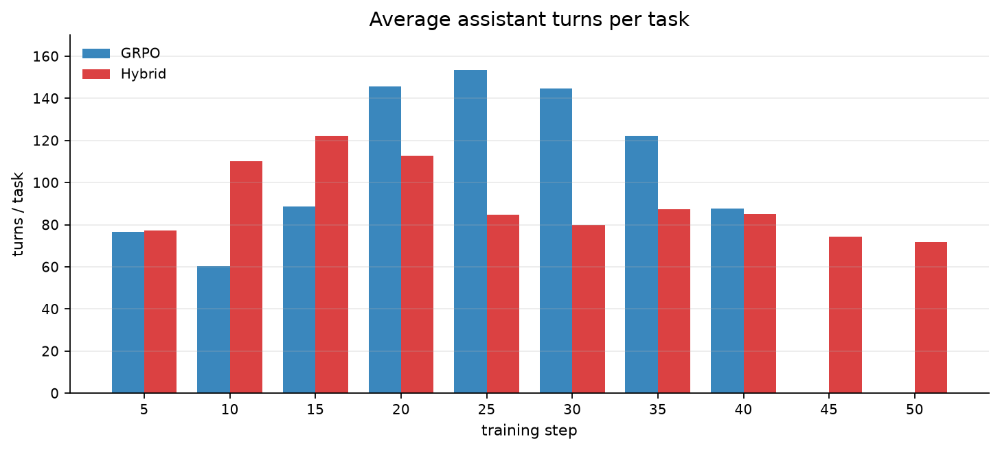
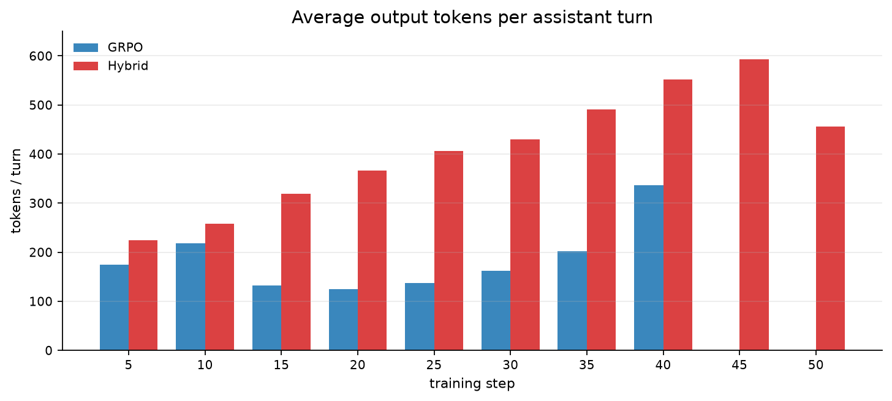
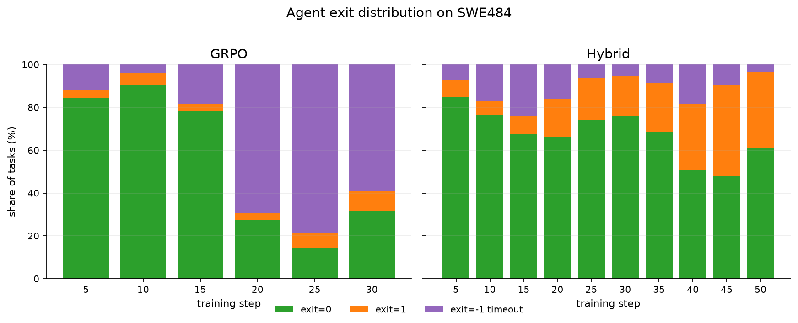
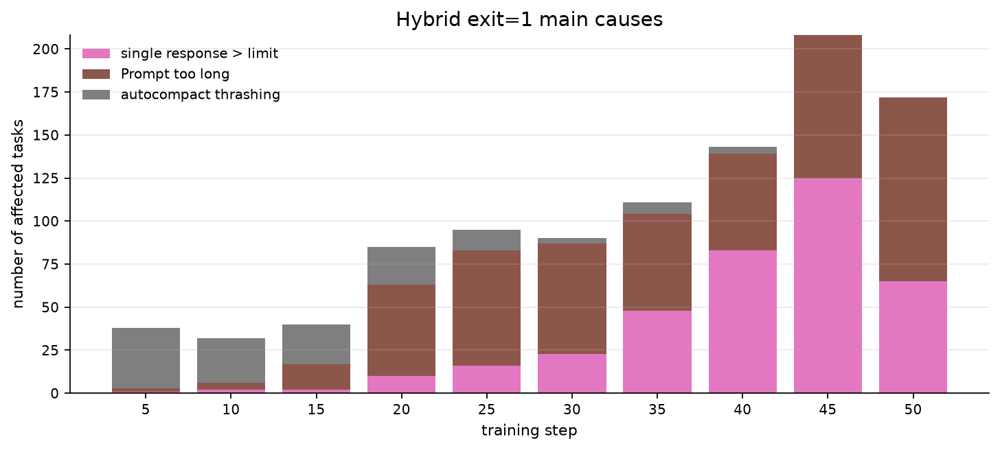
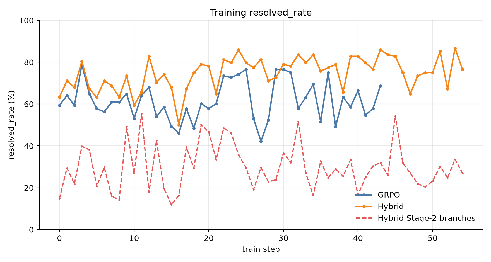
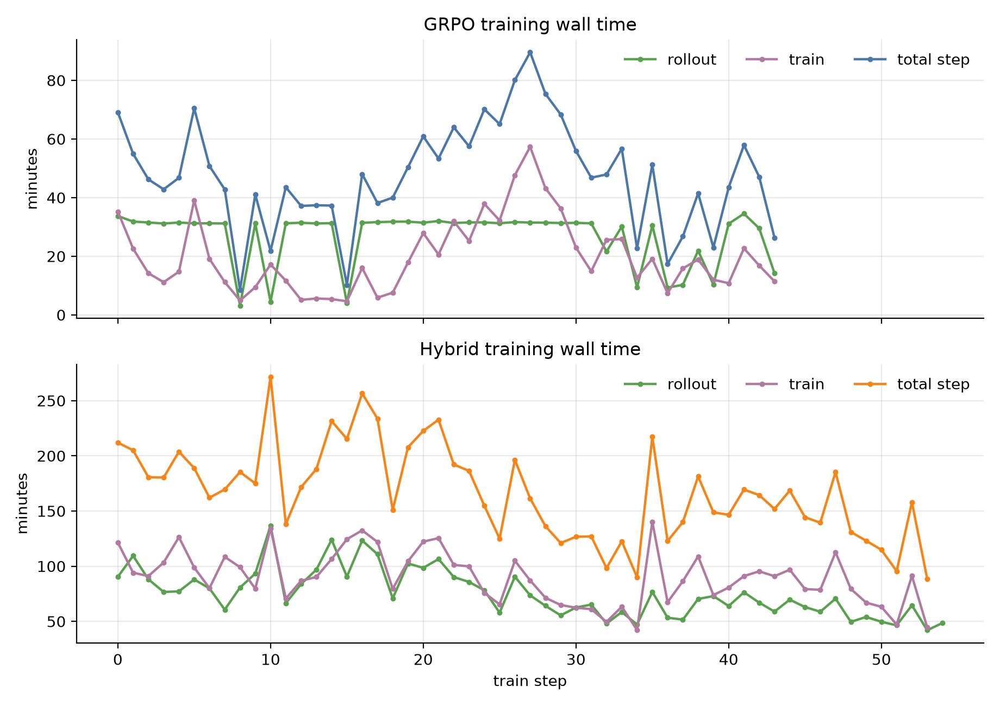
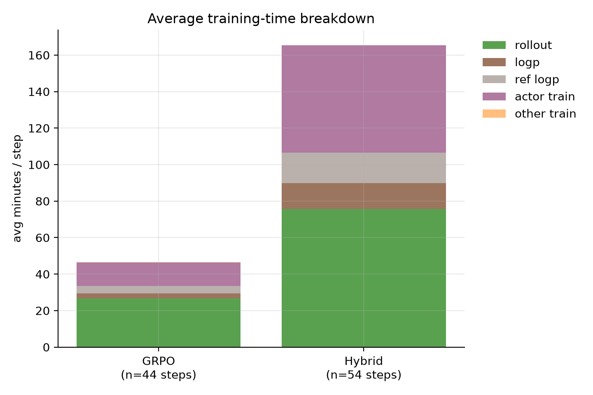
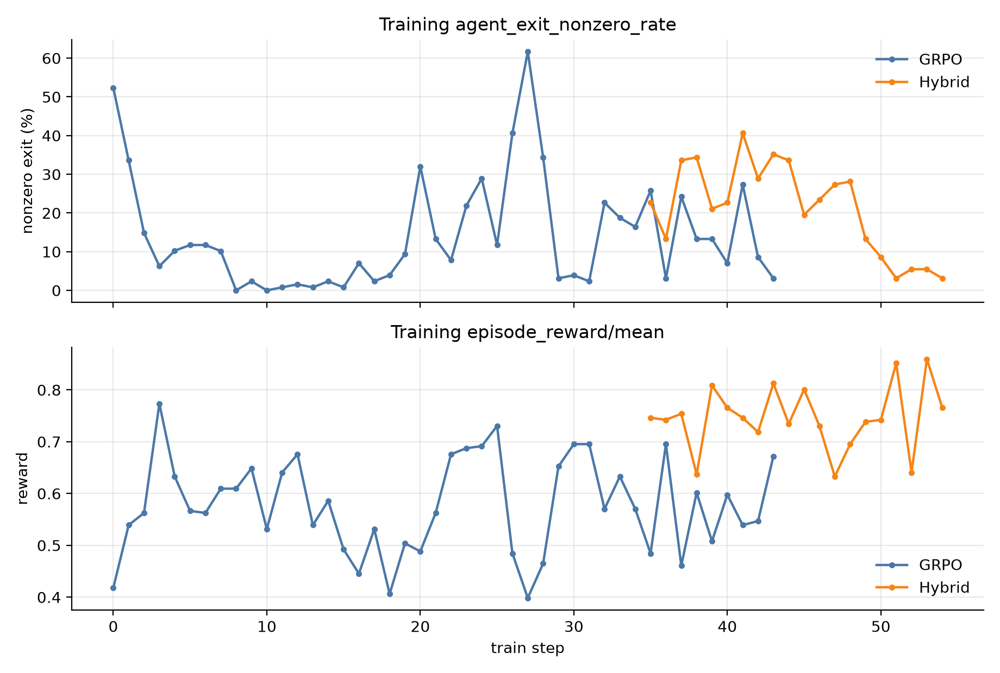
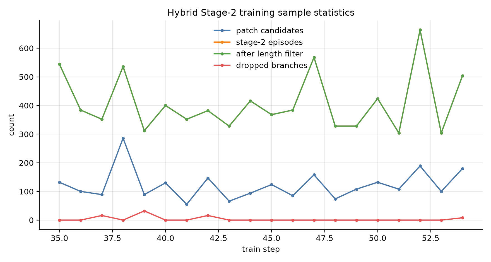

# Hybrid 与 GRPO 在 SWE-bench Verified 484 上的行为变化

本文记录 Qwen3.5-9B 经过朴素 GRPO 与 Hybrid step-GRPO 训练后，在 SWE-bench Verified 484 pass@1 评测中的行为变化。重点不是只看 resolved rate，而是看模型如何完成任务：交互轮数、每轮输出长度、退出状态和失败形态。

## 1. 一句话结论

- GRPO 后期主要问题是交互轮数变多，导致 30 分钟 agent 预算更容易被耗尽，表现为 `exit_code=-1` 增多。
- Hybrid 后期主要问题不是轮数爆炸，而是每轮 assistant 输出明显变长，导致上下文压力变大，表现为 `Prompt too long`、单轮输出超过上限和 compact 失败增多。
- Hybrid 在 SWE484 pass@1 上整体高于 GRPO，但训练到较后期后收益不再单调上升，说明继续训练同时带来了行为副作用。

## 2. 评测口径

| 项 | 口径 |
|---|---|
| 评测集 | SWE-bench Verified 484 |
| 指标 | pass@1，即每题采样 1 次，最终 `resolved=True` 记为做对 |
| Agent | Claude Code harness + Qwen3.5-9B actor |
| Agent 时间预算 | 30 min |
| 测试执行超时 | 2700 s |
| 行为统计来源 | 每题落盘的 `trajectory.jsonl` |
| assistant turn | 主会话中一次 assistant 响应；不统计 subagent |
| 每轮输出 tokens | `stream_event.message_delta.usage.output_tokens` |
| `exit_code=0` | agent 正常结束 |
| `exit_code=1` | agent 运行时报错退出，例如 prompt 过长、单轮输出过长、compact 失败 |
| `exit_code=-1` | agent 达到 30 min 预算被终止 |

说明：GRPO step35/step40 的部分评测结果落盘不完整，因此 pass@1 趋势只画到 step30；行为轨迹仍可用于 turns/tokens 统计。Hybrid step45 使用原始 262/484 结果，另有 1 条 replay 当时未并入。

## 3. pass@1 随训练变化

| step | GRPO resolved | GRPO pass@1 | Hybrid resolved | Hybrid pass@1 |
|---:|---:|---:|---:|---:|
| 0 | 249/484 | 51.45% | 249/484 | 51.45% |
| 5 | 239/484 | 49.38% | 262/484 | 54.13% |
| 10 | 239/484 | 49.38% | 273/484 | 56.40% |
| 15 | 213/484 | 44.01% | 264/484 | 54.55% |
| 20 | 125/484 | 25.83% | 269/484 | 55.58% |
| 25 | 117/484 | 24.17% | 269/484 | 55.58% |
| 30 | 147/484 | 30.37% | 274/484 | 56.61% |
| 35 | - | - | 278/484 | 57.44% |
| 40 | - | - | 267/484 | 55.17% |
| 45 | - | - | 262/484 | 54.13% |
| 50 | - | - | 265/484 | 54.75% |

观察：

- Hybrid 从 step5 到 step35 基本稳定高于 Base，并在 step35 达到当前最高 278/484。
- GRPO 从 step15 后明显掉点，step20/25 尤其严重。
- Hybrid step40 之后没有继续上升，说明继续训练没有稳定转化为 SWE484 收益。

## 4. 行为变化：轮数与每轮输出

| step | GRPO turns/task | GRPO tokens/turn | Hybrid turns/task | Hybrid tokens/turn |
|---:|---:|---:|---:|---:|
| 5 | 76.5 | 175.2 | 77.4 | 224.3 |
| 10 | 60.3 | 217.8 | 110.1 | 258.0 |
| 15 | 88.7 | 132.1 | 122.1 | 319.6 |
| 20 | 145.6 | 124.7 | 112.7 | 366.9 |
| 25 | 153.5 | 137.0 | 84.9 | 405.9 |
| 30 | 144.6 | 162.6 | 80.0 | 429.9 |
| 35 | 122.2 | 202.3 | 87.5 | 491.6 |
| 40 | 87.7 | 336.4 | 85.2 | 552.6 |
| 45 | - | - | 74.5 | 593.5 |
| 50 | - | - | 71.8 | 456.6 |

观察：

- GRPO 的典型异常是 turns/task 在 step20-step30 明显升高，step20 为 145.6，step25 为 153.5。
- Hybrid 的 turns/task 没有同样爆炸，step25 以后反而低于 GRPO。
- Hybrid 的 tokens/turn 从 step15 开始明显高于 GRPO，step40 达到 552.6，step45 达到 593.5。

因此，两者的行为问题不同：

| 模型 | 主要变化 | 直接后果 |
|---|---|---|
| GRPO | 轮数变多 | 更容易耗尽 30 min agent 预算 |
| Hybrid | 每轮输出变长 | 更容易撑爆上下文或单轮输出上限 |

## 5. 退出状态变化

| step | GRPO exit=0 | GRPO exit=1 | GRPO exit=-1 | Hybrid exit=0 | Hybrid exit=1 | Hybrid exit=-1 |
|---:|---:|---:|---:|---:|---:|---:|
| 5 | 408 | 20 | 56 | 411 | 38 | 35 |
| 10 | 437 | 28 | 19 | 369 | 32 | 82 |
| 15 | 380 | 15 | 89 | 327 | 40 | 116 |
| 20 | 132 | 17 | 335 | 321 | 85 | 77 |
| 25 | 69 | 34 | 381 | 359 | 95 | 30 |
| 30 | 154 | 44 | 286 | 368 | 90 | 26 |
| 35 | - | - | - | 332 | 111 | 41 |
| 40 | - | - | - | 246 | 148 | 90 |
| 45 | - | - | - | 231 | 208 | 45 |
| 50 | - | - | - | 296 | 172 | 16 |

观察：

- GRPO step20/25 的 `exit=-1` 极高，分别是 335/484 和 381/484。这说明大量任务不是明确提交失败，而是 agent 没能在 30 分钟内自然结束。
- Hybrid 没有出现 GRPO 这种 timeout 爆炸。Hybrid 的主要异常是 `exit=1` 增多，尤其 step45 达到 208/484。
- Hybrid 的 `exit=1` 不能直接等价于做错，因为其中不少样本已经打出正确 patch，后续因为运行边界退出。

## 6. Hybrid 的 `exit=1` 来自哪里

| step | 单轮输出超过上限 | Prompt too long | compact 失败 |
|---:|---:|---:|---:|
| 5 | 1 | 2 | 35 |
| 10 | 2 | 4 | 26 |
| 15 | 2 | 15 | 23 |
| 20 | 10 | 53 | 22 |
| 25 | 16 | 67 | 12 |
| 30 | 23 | 64 | 3 |
| 35 | 48 | 56 | 7 |
| 40 | 83 | 56 | 4 |
| 45 | 125 | 83 | 0 |
| 50 | 65 | 107 | 0 |

术语说明：

- 单轮输出超过上限：一次 assistant response 超过 `CLAUDE_CODE_MAX_OUTPUT_TOKENS=4096`。
- `Prompt too long`：下一次模型请求的完整上下文超过可接受长度；compact 没能把它压回安全范围。
- compact 失败：Claude Code 尝试自动压缩历史，但短时间内反复压缩仍无法维持可用空间。

观察：

- Hybrid 早期主要是 compact 失败。
- step20 之后 `Prompt too long` 明显增加。
- step35 之后单轮输出超过上限快速增加，step45 达到 125 条。

这与 tokens/turn 的上升一致：Hybrid 后期不是单纯多做几轮，而是每轮输出本身变肥。

## 7. 为什么会出现这种分化

两种训练都主要使用最终是否 resolved 作为奖励。这个奖励能告诉模型“最后做没做对”，但不能细致地区分“短路径做对”和“长路径做对”。

GRPO 从完整 episode 开始训练。如果一条轨迹通过更多读取、更多搜索、更多测试获得 resolved，那么整条轨迹都会得到正向更新。这样容易强化：

- 继续读文件；
- 继续 grep；
- 继续跑测试；
- patch 后继续检查；
- 不急着结束。

所以 GRPO 的副作用更容易表现为 turns 增多，并最终撞到 30 分钟预算。

Hybrid 额外训练的是从编辑点之后继续完成任务的 continuation。它更强地奖励“打出 patch 之后继续做什么”。如果 patch 已经正确，后面继续解释、继续验证、继续修补，即使最终因为 `exit=1` 退出，只要 evaluator 判 resolved，仍可能拿到高 reward。

所以 Hybrid 的副作用更容易表现为：

- edit 后继续写较长说明；
- 测试和修复之间夹杂更长的自然语言；
- 每轮 response 更长；
- 上下文更快膨胀。

简化地说：

| 算法 | 奖励更容易强化什么 | 副作用 |
|---|---|---|
| GRPO | 从头到尾多轮探索和测试 | turns 增多，timeout 增多 |
| Hybrid | edit 后继续验证和解释 | tokens/turn 增多，Prompt too long 增多 |

## 8. 当前判断

- Hybrid 当前不是“没有学到东西”。它在 SWE484 pass@1 上明显强于 GRPO，并且 step5-step35 基本稳定高于 Base。
- GRPO 后期主要是停止行为退化：模型仍可能有 patch 能力，但大量任务在 30 分钟内没有自然结束。
- Hybrid 后期主要是输出控制退化：模型更愿意在 patch 后继续展开，导致上下文和单轮输出边界问题。

## 9. 训练时指标

本节统计训练集 rollout，不是 SWE-bench Verified 484 评测。GRPO 使用 128 条完整 episode 更新；Hybrid 的 `outcome/resolved_rate` 是 Stage-1 的 128 episode 口径，`outcome/stage-2/resolved_rate` 是从编辑点分叉后的 branch 口径，二者不能直接当作同一种样本分布。

Hybrid 早期部分日志行被截断，因此 `resolved_rate`、耗时、Stage-2 resolved_rate 可以完整抽取；`agent_exit_nonzero_rate`、reward 和详细 Stage-2 样本数只在 step35 之后的完整日志中可用。

### 9.1 训练 resolved_rate

| step window | GRPO resolved | Hybrid Stage-1 resolved | Hybrid Stage-2 branch resolved |
|---|---:|---:|---:|
| 0-9 | 62.73% | 68.98% | 27.40% |
| 10-21 | 56.45% | 69.53% | 32.47% |
| 22-33 | 66.15% | 79.10% | 33.56% |
| 34-43 | 61.48% | 78.91% | 26.55% |
| 44-53 | - | 76.88% | 29.30% |

观察：

- 训练集上，Hybrid 的 Stage-1 resolved_rate 在所有可比窗口都高于 GRPO。
- Stage-2 branch resolved_rate 明显低于 Stage-1，因为它统计的是“从某个编辑点继续跑”的局部分叉，不是从头开始完成整题。
- 训练 resolved_rate 的高低与 SWE484 pass@1 趋势一致：Hybrid 整体高于 GRPO，但后期没有单调上升。

### 9.2 训练耗时

| run | steps | resolved_rate | Stage-2 resolved_rate | rollout min/step | train min/step | logp min/step | ref logp min/step | actor train min/step | total min/step |
|---|---:|---:|---:|---:|---:|---:|---:|---:|---:|
| GRPO | 0-43 | 61.67% | - | 26.8 | 19.9 | 2.8 | 4.0 | 12.9 | 47.4 |
| Hybrid | 0-53 | 74.65% | 30.09% | 75.8 | 89.7 | 14.2 | 16.7 | 58.8 | 166.9 |

说明：

- Hybrid 平均每步约 166.9 min，是 GRPO 的 3.5 倍。
- 差异主要来自两部分：Hybrid rollout 需要额外跑 Stage-2 分叉；训练阶段也要对 Stage-1 与 Stage-2 token 一起算 logp、ref logp 和 actor update。
- Hybrid 的 actor train 平均 58.8 min/step，GRPO 为 12.9 min/step，说明 Hybrid 的有效训练 token 规模显著更大。

### 9.3 训练退出与 reward

| 指标 | GRPO | Hybrid |
|---|---:|---:|
| `agent_exit_nonzero_rate` 可用步数 | 44 | 20 |
| `episode_reward/mean` 可用步数 | 44 | 20 |
| Hybrid 可用窗口 | - | step35-step54 |

说明：

- GRPO 的训练 exit/reward 指标 0-43 步完整可见。
- Hybrid 的完整 exit/reward 指标只在 step35 之后可见，因此这里用于观察后期状态，不用于和 GRPO 做全程均值对比。

### 9.4 Hybrid Stage-2 样本规模

| 指标 | step35-step54 平均值 | 含义 |
|---|---:|---|
| `n_stage1_episodes` | 128.0 | 每步 Stage-1 真实 episode 数 |
| `n_patch_candidates` | 122.3 | Stage-1 中可作为分叉点的 patch turn 候选数 |
| `n_selected_edits` | 51.6 | 实际被选中做 Stage-2 分叉的编辑点数 |
| `n_stage2_episodes` | 409.1 | Stage-2 实际产生的 branch episode 数 |
| `n_stage2_samples_after_length_filter` | 409.1 | 长度过滤后仍进入训练的 Stage-2 样本数 |
| `n_dropped_branches` | 3.6 | Stage-2 中被丢弃的 branch 数 |
| `stage1_active_tokens` | 2.91M | Stage-1 参与 loss 的 token 数 |
| `stage2_active_tokens` | 3.59M | Stage-2 参与 loss 的 token 数 |

观察：

- Hybrid 后期每步仍稳定保留 128 条 Stage-1 episode。
- Stage-2 平均每步约 409 条 branch episode，长度过滤后基本没有额外丢弃。
- Stage-2 active tokens 比 Stage-1 更多，这解释了 Hybrid 训练阶段耗时明显高于 GRPO。
